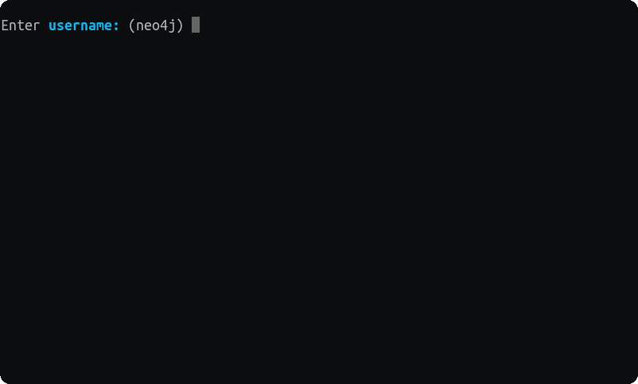

# persephone

persephone is a Neo4j client on the command line
(and a powerful and visually appealing [fictional character][why] in _The Matrix_).

It brings rapid database exploration, development and automation to the terminal.

## Installation

Download binaries for various platforms and operating systems from the [releases page][].

### Build from source

See here on how to [build persephone from source][build from source].

## Comparison with Cypher Shell and neo4j-client

### neo4j-client

The development of [neo4j-client][] started in early 2016.
It was - and still is - a feature-rich unofficial Neo4j command line client.
It uses Bolt protocol version 1, which is not supported by Neo4j 3.5 and newer. 

### Cypher Shell

About half a year later, the official Cypher Shell was built by Neo4j, Inc.
It became part of the Neo4j distribution.

Cypher Shell CLI is used to run queries and perform administrative tasks against a Neo4j instance.
By default, the shell is interactive, but you can also use it for scripting, by passing cypher
directly on the command line or by piping a file with cypher statements.

Cypher Shell requires Java 8 or newer, lacks some commands from [Neo4j Browser][],
and does not provide a rich command line experience like autocompletion for Cypher statements.

### persephone

persephone is a new project that helps us explore what an official Neo4j CLI could look like
with a fundamentally different __human-first__ design.
It implements well-established [Command Line Interface Guidelines],
which are implemented in modern CLIs, including, but not limited to

- [AWS CLI][]
- [Azure CLI][]
- [GitHub CLI][]
- and alike.

persephone comes with the official Neo4j Driver, which implements Bolt protocol version 3,
and works with Neo4j 3.5 and newer.
It has no runtime dependencies and runs on a variety of platforms and operating systems.

Check out a [more detailed explanation][alternatives] about alternatives to learn more.

## Contributing

If anything feels off, or if you feel that some functionality is missing, please check out the [contributing][] page.
There you will find instructions for sharing your feedback, building the application locally,
and submitting pull requests to the project.

<!-- internal links -->

[alternatives]: ./docs/alternatives.md
[build from source]: ./docs/source.md
[contributing]: ./docs/contributing.md
[releases page]: https://github.com/abc-inc/persephone/releases/latest
[why]: ./docs/why.md

<!-- external references -->
[Bolt compatibility]: https://neo4j.com/docs/bolt/current/bolt-compatibility/
[Command Line Interface Guidelines]: https://clig.dev/

<!-- other products -->
[AWS CLI]: https://aws.amazon.com/cli
[Azure CLI]: https://docs.microsoft.com/en-us/cli/azure/
[GitHub CLI]: https://cli.github.com/
[Neo4j Browser]: https://github.com/neo4j/neo4j-browser
[neo4j-client]: https://github.com/cleishm/libneo4j-client
